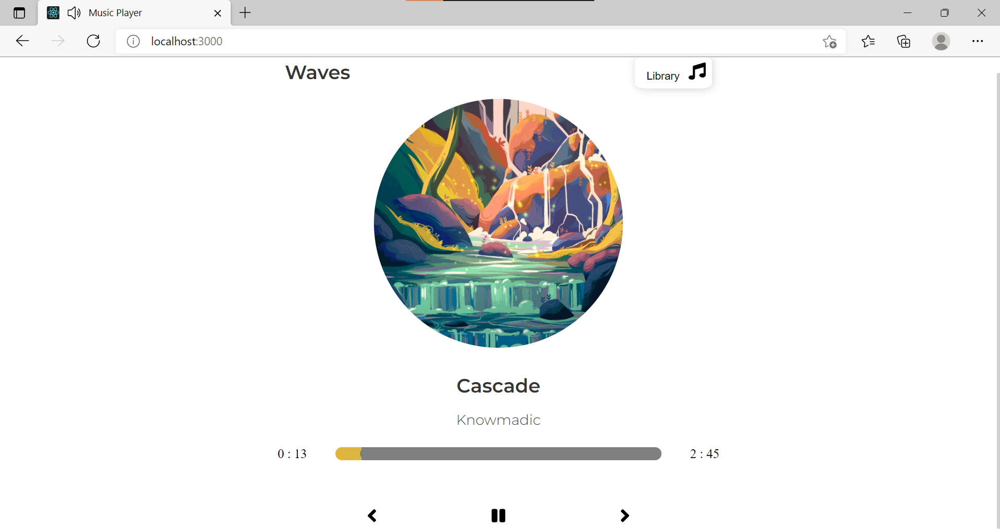

# Chill Hop Music Player Web App

### Website to try out the Chill Hop Music Player - [https://chillhop-audio.netlify.app/](https://chillhop-audio.netlify.app/)

### A Unique and Minimal Music Player with Complex State Management and a beautiful front-end made using react.

### Some features include:

- Prop Drilling
- State Management
- UUID
- Sass
- React
- Custom music playerbar
- Custom playerbar gradients
- UI Animations

## To Run clone the repository, run npm i and then npm start

### Images and Presentation

